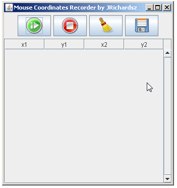

# Super Mouse Recorder

Super Mouse Recorder is a open source mouse recording application which will record your computer mouse actions , allowing you to repeat an operation easily and fast.

Keywords : Java , swing, mouse, JNativeHook-1.1.4, org.jnativehook.Jnativehook

# Inspiration

I do this because I needed some pixels coordinates of my screen or monitor.

# Usage 

- Download the zip file : [super-mouse-recorder.zip](https://github.com/jrichardsz/super-mouse-recorder/blob/master/app/super-mouse-recorder.zip?raw=true)
- Unzip it.
- Doble click on **super-mouse-recorder.jar** file. If you have java installed, the application will be launched.



- Press start button (green)
- Drag and Drop your mouse
- You will see the initial and last coordinates in the table.
- You can save coordinates in txt or autoit file.

# Getting Started for Developers

These instructions will get you a copy of the project up and running on your local machine for development and testing purposes. See deployment for notes on how to deploy the project on a live system.

# Prerequisites

- [Java](http://www.oracle.com/technetwork/java/javase/downloads/jdk7-downloads-1880260.html)
- [Download Maven](http://maven.apache.org/download.cgi)
- [Install Maven](http://maven.apache.org/install.html)

## Repository

Clone this repo:

```
git clone https://github.com/jrichardsz/appdesktop-super-mouse-recorder.git
```

## Maven offline or no public jars 

- Open command line point at [maven-offline-jars](https://github.com/jrichardsz/appdesktop-super-mouse-recorder/tree/master/maven-offline-jars)

- execute

```
mvn install:install-file -Dfile=JNativeHook-1.1.4.jar -DgroupId=org.jnativehook -DartifactId=JNativeHook  -Dversion=1.1.4 -Dpackaging=jar
```

This mvn command will install JNativeHook library that is required in order to develop or compile this app.

- Install my libraries with maven:

  - [https://github.com/jrichardsz/libraries/tree/master/linet-util](https://github.com/jrichardsz/libraries/tree/master/linet-util)
  - [https://github.com/jrichardsz/libraries/tree/master/linet-swing](https://github.com/jrichardsz/libraries/tree/master/linet-swing)

## Compile

- Go to **code** folder and execute

```
mvn clean package
```

This will create a folder called **app** inside of src folder. 

## Running the tests

...

## Deployment

- Open the **code** folder whit netbeans (default swing editor) or eclipse (plugin swing editr is required)
- Maven must be supported in your IDE.


## And coding style tests

...


## Built With

* [Maven](https://www.apache.org/) - Apache Maven is a software project management and comprehension tool
* [Java](http://www.oracle.com/technetwork/java/javase/downloads/jdk7-downloads-1880260.html) - Java SE Development Kit 7 Downloads

## Contributing

....

## Coming Soon

....

## Useful links

...

## Authors

*JRichardsz* - [contact me](http://jrichardsz.github.io)

## License

Voce is licensed under the BSD or LGPL Open Source licenses. 

